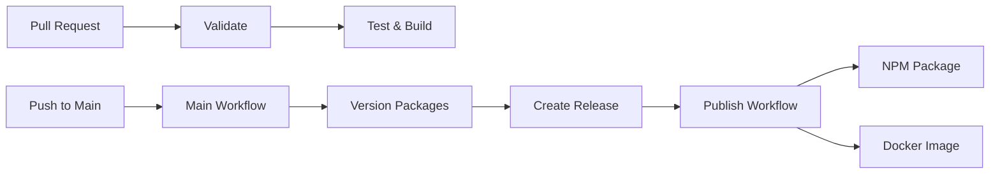

# GitHub Actions Workflows Documentation

This document describes the GitHub Actions workflows used in this repository.

## Workflow Overview

## Important Setup Requirements

### Personal Access Token for Release Workflow

The Main workflow creates GitHub releases that should trigger the Publish workflow. However, due to GitHub's security
features, workflows triggered by the default `GITHUB_TOKEN` cannot trigger other workflows (this prevents infinite
loops).

**To enable the Publish workflow to trigger automatically:**

1. Create a Personal Access Token (PAT) with the following permissions:
   - `contents:write` - To create releases
   - `actions:read` - To trigger workflows

2. Add the PAT as a repository secret named `RELEASE_TOKEN`:
   - Go to Settings → Secrets and variables → Actions
   - Click "New repository secret"
   - Name: `RELEASE_TOKEN`
   - Value: Your PAT

3. The Main workflow will automatically use `RELEASE_TOKEN` if available, falling back to `GITHUB_TOKEN` if not configured.

## Workflows

### 1. Pull Request Workflow (`pr.yml`)

**Purpose**: Validates and tests all pull requests.

**Triggers**: Pull requests to `main` branch

**Jobs**:

- **validate**: Checks changeset status
- **security-audit**: Runs security audit
- **type-checking**: TypeScript type checking
- **linting**: ESLint checks
- **format-checking**: Prettier formatting checks
- **test**: Runs test suite with coverage
- **codeql**: Security analysis
- **osv-scan**: Vulnerability scanning

### 2. Main Workflow (`main.yml`)

**Purpose**: Handles versioning and release creation when changes are merged to main.

**Triggers**: Push to `main` branch

**Jobs**:

- **build**:
  - Checks for changesets (fails if releasable commits lack changesets)
  - Versions packages using changesets
  - Builds artifacts and generates SBOM
  - Creates GitHub release with artifacts
  - Generates build attestations

**Important**: Requires `RELEASE_TOKEN` secret to trigger the publish workflow.

### 3. Publish Workflow (`publish.yml`)

**Purpose**: Publishes packages to registries after a release.

**Triggers**:

- Release published event
- Manual workflow dispatch

**Jobs**:

- **npm**: Publishes to NPM (requires `ENABLE_NPM_RELEASE` variable and `NPM_TOKEN` secret)
- **docker**: Builds and publishes Docker images (requires `ENABLE_DOCKER_RELEASE` variable)

## Configuration

### Required Secrets

| Secret               | Purpose                                       | Required For    |
| -------------------- | --------------------------------------------- | --------------- |
| `RELEASE_TOKEN`      | PAT to trigger publish workflow from releases | Auto-publish    |
| `NPM_TOKEN`          | NPM authentication                            | NPM publishing  |
| `DOCKERHUB_USERNAME` | Docker Hub username                           | Docker Hub push |
| `DOCKERHUB_TOKEN`    | Docker Hub access token                       | Docker Hub push |

### Repository Variables

| Variable                | Purpose                    | Default |
| ----------------------- | -------------------------- | ------- |
| `ENABLE_NPM_RELEASE`    | Enable NPM publishing      | `false` |
| `ENABLE_DOCKER_RELEASE` | Enable Docker distribution | `false` |

## Setup Instructions

### 1. Create a Personal Access Token for Releases

Create a fine-grained PAT with:

- **Repository access**: Your repository
- **Permissions**: Contents (Write), Actions (Read)

Add as `RELEASE_TOKEN` secret.

### 2. Configure NPM Publishing

1. Get NPM token from npmjs.com
2. Add as `NPM_TOKEN` secret
3. Set `ENABLE_NPM_RELEASE=true` variable

### 3. Enable Docker Distribution (Optional)

1. Set `ENABLE_DOCKER_RELEASE=true` variable
2. Add Docker Hub credentials if using Docker Hub

## How It Works

1. **Developer creates PR** with changes and changeset
2. **CI validates** the PR (tests pass, changeset present)
3. **PR is merged** to main branch
4. **Main workflow runs**:
   - Checks for changesets
   - Versions packages
   - Builds artifacts
   - Creates GitHub release
5. **Publish workflow triggers** (if `RELEASE_TOKEN` configured):
   - Publishes to NPM
   - Builds Docker images
   - Deploys to configured targets

## Troubleshooting

### Publish Workflow Not Triggering

- Verify `RELEASE_TOKEN` secret is configured
- Ensure the PAT has `contents:write` and `actions:read` permissions
- Check that the release was created (not draft)

### NPM Publish Failing

- Verify `NPM_TOKEN` is valid
- Check `ENABLE_NPM_RELEASE` variable is set to `true`
- Ensure package.json version doesn't already exist

### Missing Changesets

- Main workflow will fail if releasable commits lack changesets
- Add changesets with `pnpm changeset`

## Best Practices

1. **Always include changesets** in PRs with changes
2. **Configure `RELEASE_TOKEN`** for automatic publishing
3. **Keep secrets secure** and rotate regularly
4. **Monitor workflow runs** for failures
5. **Use `pnpm verify`** before pushing code
